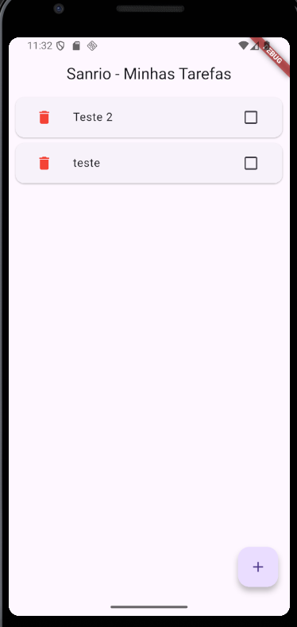
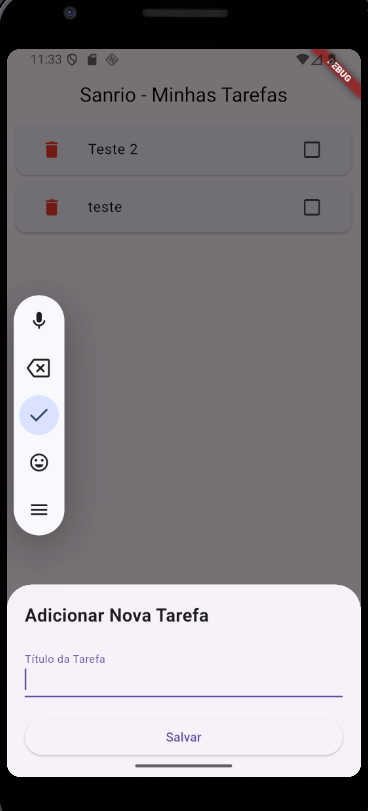

Olá\! Com certeza\! Analisei a estrutura e o código do seu projeto para criar um `README.md` completo e informativo que descreve sua aplicação de lista de tarefas.

Aqui está uma sugestão de `README.md` para o seu projeto. Você pode copiar e colar o conteúdo abaixo em um novo arquivo chamado `README.md` na raiz do seu projeto.

-----

# To-Do List App com Flutter & Firebase

Um aplicativo de lista de tarefas simples e funcional, desenvolvido com Flutter e integrado ao Firebase para armazenamento e sincronização de dados em tempo real.

## Überblick

Este projeto é um aplicativo de lista de tarefas (To-Do List) que permite aos usuários adicionar, visualizar, marcar como concluídas e excluir tarefas. A aplicação utiliza o Cloud Firestore do Firebase como backend, o que garante que as tarefas sejam sincronizadas em tempo real entre todos os dispositivos conectados.

A interface é limpa e intuitiva, com um tema "Sanrio" sugerido pelo código, tornando a experiência do usuário agradável.

## ✨ Funcionalidades

  * **Adicionar Tarefas:** Adicione novas tarefas de forma rápida através de um painel inferior.
  * **Visualizar Tarefas:** Veja todas as suas tarefas em uma lista organizada.
  * **Marcar como Concluída:** Marque e desmarque tarefas, com uma indicação visual (riscado) para itens concluídos.
  * **Excluir Tarefas:** Remova tarefas da lista com um simples toque no ícone da lixeira.
  * **Sincronização em Tempo Real:** As tarefas são atualizadas instantaneamente em todos os dispositivos graças ao poder do Cloud Firestore.

## 🛠️ Tecnologias Utilizadas

  * **[Flutter](https://flutter.dev/):** Framework de desenvolvimento de UI para criar interfaces nativas compiladas para mobile, web e desktop a partir de uma única base de código.
  * **[Dart](https://dart.dev/):** Linguagem de programação utilizada pelo Flutter.
  * **[Firebase](https://firebase.google.com/):** Plataforma de desenvolvimento de aplicativos da Google.
      * **[Cloud Firestore](https://firebase.google.com/docs/firestore):** Banco de dados NoSQL flexível e escalável para desenvolvimento mobile, web e de servidores.
      * **[Firebase Core](https://firebase.google.com/docs/flutter/setup):** Plugin do Flutter para conectar a aplicação ao Firebase.

## 🚀 Como Começar

Para executar este projeto localmente, siga os passos abaixo.

### Pré-requisitos

  * Você precisa ter o Flutter instalado em sua máquina. Para mais informações, consulte a [documentação oficial do Flutter](https://flutter.dev/docs/get-started/install).
  * Um projeto Firebase configurado. Se você não tiver um, crie um no [Firebase Console](https://console.firebase.google.com/).
  * O arquivo de configuração do Firebase (`firebase_options.dart`) deve estar corretamente configurado no diretório `lib/`.

### Instalação e Execução

1.  **Clone o repositório:**
    ```bash
    git clone <URL_DO_SEU_REPOSITORIO>
    ```
2.  **Acesse o diretório do projeto:**
    ```bash
    cd nome-do-projeto
    ```
3.  **Instale as dependências:**
    ```bash
    flutter pub get
    ```
4.  **Execute o aplicativo:**
    ```bash
    flutter run
    ```

## 📂 Estrutura do Projeto

Abaixo está uma visão geral da estrutura de arquivos e diretórios mais importantes:

```
/
├── android/         # Configurações específicas para Android
├── ios/             # Configurações específicas para iOS
├── lib/
│   ├── firebase_options.dart  # Configurações de conexão com o Firebase
│   └── main.dart              # Ponto de entrada e lógica principal da aplicação
├── test/            # Testes de widgets
└── pubspec.yaml     # Definição de metadados e dependências do projeto
```

## 🖼️ Screenshots

*(Adicione aqui screenshots do seu aplicativo para demonstrar a aparência e o funcionamento)*

|       Tela Principal       |     Adicionando Tarefa      |
| :-------------------------:| :-------------------------: |
| *()* |*()* |
